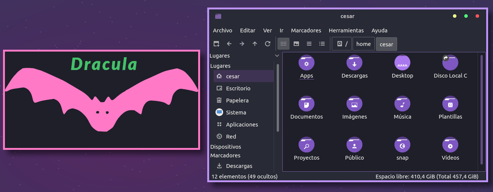
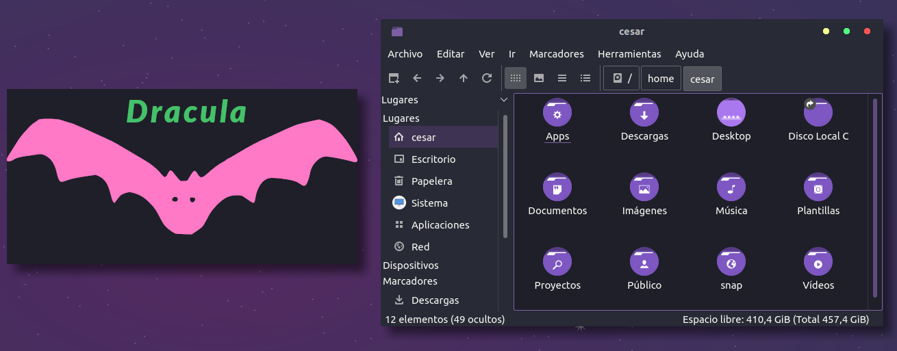
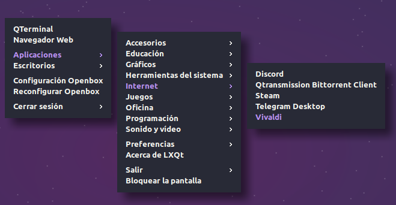

# Dracula for [Openbox](http://openbox.org/wiki/Main_Page)

> A dark theme for Openbox WM based on the [Dracula color scheme](https://draculatheme.com). It is compatible with the Ant-Dracula GTK and KDE themes. It's also available on [Gitlab](https://gitlab.com/the-zero885/dracula-for-openbox).

**Theme with border**

**Borderless theme**

**Menu theme** 

## Install
Place the repository folders: **Dracula** and **Dracula-withoutBorder** in the <code>/home/your-user/.themes</code> directory and select with the **Openbox configuration** the theme of your preference.

To install the menu, first install with Muon/Synaptic package manager: <code>openbox-menu</code> and <code>lxmenu-data</code> (or write in the terminal <code>sudo apt-get install openbox-menu lxmenu-data</code>) and copy the file **menu.xml** to the <code>/home/your-user/.config/openbox</code> or <code>/usr/share/lubuntu/openbox/menu.xml</code> folder depending on your desktop language and whether it is LXDE or LXQt. 

**Note:** 

## Team

This theme is maintained by the following person(s) and a bunch of [awesome contributors](https://github.com/dracula/template/graphs/contributors).

|  |
|---|
| [César Salazar](https://github.com/the-zero885) |

## License

[MIT License](./LICENSE)
