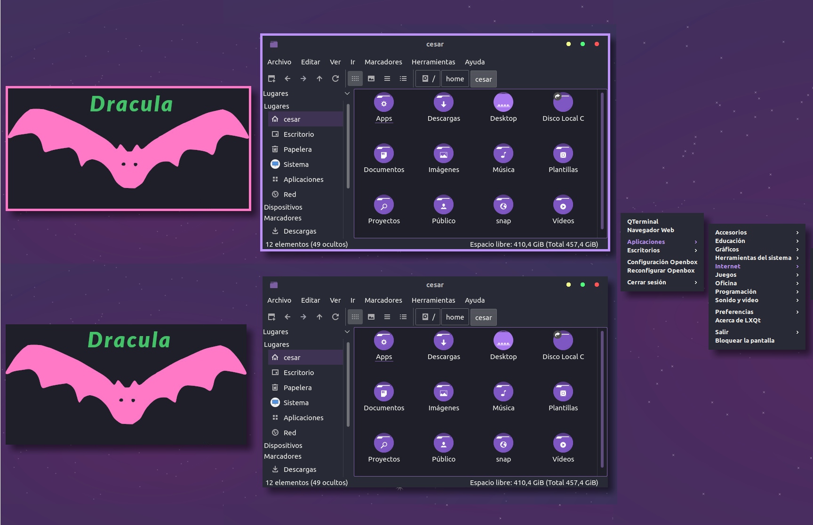

# Dracula for [Openbox](http://openbox.org/wiki/Main_Page)

> A dark theme for Openbox WM based on the [Dracula color scheme](https://draculatheme.com). It is compatible with the Ant-Dracula GTK and KDE themes. It's also available on [Gitlab](https://gitlab.com/the-zero885/dracula-for-openbox).

## Install

All instructions can be found at [INSTALL.md](./INSTALL.md) in repository folder.

## Team

This theme is maintained by the following person(s) and a bunch of [awesome contributors](https://github.com/dracula/openbox/graphs/contributors).

|  |
| ---------------------------------------------------------------------------------------------------------- |
| [César Salazar](https://github.com/the-zero885)                                                            |

## Community

- [Twitter](https://twitter.com/draculatheme) - Best for getting updates about themes and new stuff.
- [GitHub](https://github.com/dracula/dracula-theme/discussions) - Best for asking questions and discussing issues.
- [Discord](https://draculatheme.com/discord-invite) - Best for hanging out with the community.

## License

[MIT License](./LICENSE)
